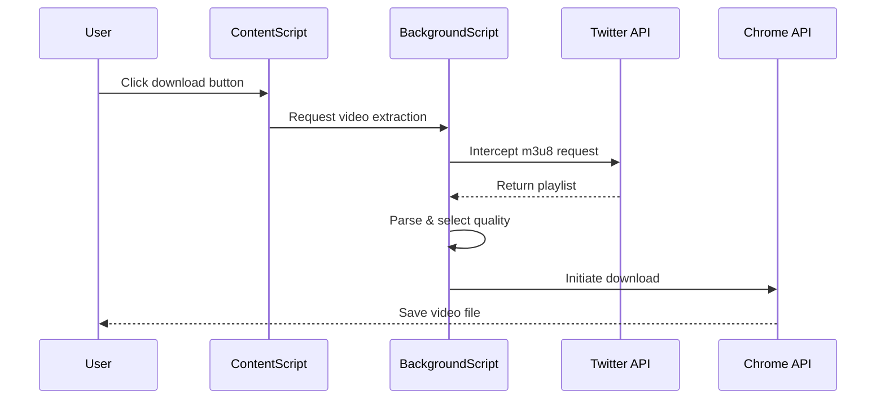
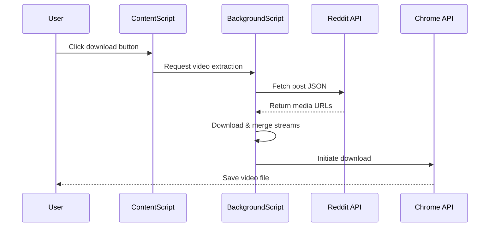

# Product Requirements Document (PRD)
## Video Downloader Chrome Extension for Twitter/X & Reddit

### Version 1.0 | Date: January 2025

---

## 1. Executive Summary

### Product Overview
SocviDL is a lightweight Chrome extension that enables users to download videos from Twitter/X and Reddit with a single click. The extension automatically detects videos on these platforms and injects a download button for seamless video saving.

### Vision Statement
Create the simplest, fastest, and most reliable video downloader for Twitter/X and Reddit that "just works" without configuration.

### MVP Goal
Ship a functional video downloader within 4 weeks that handles 80% of use cases with zero configuration required.

---

## 2. Problem Statement

### User Pain Points
1. **No native download option** - Both platforms intentionally omit download functionality
2. **Complex workarounds** - Users resort to sketchy third-party websites or screen recording
3. **Quality loss** - Current solutions often compress or watermark videos
4. **Time-consuming** - Copy URL → Go to website → Paste → Wait → Download

### Target Users
- Content creators who save references/inspiration
- Researchers and journalists archiving content
- Regular users wanting to save memorable content
- Social media managers collecting content for curation

---

## 3. MVP Scope (Phase 1)

### 3.1 Core Functionality

#### Must Have (MVP)
| Feature | Description | Acceptance Criteria |
|---------|-------------|-------------------|
| **Video Detection** | Automatically detect videos on Twitter/X and Reddit | - Detects 95%+ of standard video posts<br>- Works on timeline, individual posts, and threads |
| **Download Button** | Inject download button below videos | - Appears within 1 second of video load<br>- Consistent positioning<br>- Clear visual indicator |
| **One-Click Download** | Download highest quality with single click | - Downloads start within 2 seconds<br>- Automatic quality selection<br>- MP4 format only |
| **Basic Filename** | Auto-generated descriptive filename | - Format: `platform_username_timestamp.mp4`<br>- Sanitized for filesystem compatibility |
| **Progress Feedback** | Visual indication of download status | - Loading state on button<br>- Success/error indication<br>- Chrome's native download bar |

#### Platform Support (MVP)
- **Twitter/X**: Native video uploads only (not YouTube embeds)
- **Reddit**: v.redd.it hosted videos only
- **Chrome Browser**: Version 90+ (covers 95% of users)

### 3.2 Out of Scope for MVP
- ❌ Quality selection menu
- ❌ Batch downloads
- ❌ Browser compatibility beyond Chrome
- ❌ Settings/configuration page
- ❌ GIF support
- ❌ Live streams
- ❌ Audio-only extraction
- ❌ External video platforms (YouTube, Vimeo)

---

## 4. Technical Specifications

### 4.1 Architecture Overview

```
┌─────────────────────────────────────┐
│         Content Script              │
│  (Injected into Twitter/Reddit)     │
├─────────────────────────────────────┤
│  • Detect video elements            │
│  • Inject download buttons          │
│  • Handle user interactions         │
└────────────┬────────────────────────┘
             │
             ▼
┌─────────────────────────────────────┐
│       Background Script             │
├─────────────────────────────────────┤
│  • Fetch video URLs                 │
│  • Process m3u8/mpd streams         │
│  • Merge audio/video (Reddit)       │
│  • Trigger Chrome download API      │
└─────────────────────────────────────┘
```

### 4.2 Key Components

#### Manifest V3 Configuration
```json
{
  "manifest_version": 3,
  "name": "Video Downloader for Twitter & Reddit",
  "version": "1.0.0",
  "permissions": [
    "downloads",
    "storage",
    "webRequest",
    "declarativeNetRequest"
  ],
  "host_permissions": [
    "*://twitter.com/*",
    "*://x.com/*",
    "*://reddit.com/*",
    "*://*.redd.it/*",
    "*://v.redd.it/*"
  ],
  "content_scripts": [{
    "matches": [
      "*://twitter.com/*",
      "*://x.com/*",
      "*://reddit.com/*",
      "*://www.reddit.com/*"
    ],
    "js": ["content.js"],
    "css": ["styles.css"]
  }],
  "background": {
    "service_worker": "background.js"
  }
}
```

#### Core Modules

| Module | Responsibility | Key Functions |
|--------|---------------|---------------|
| **VideoDetector** | Find videos on page | `detectVideos()`, `observeMutations()`, `isVideoElement()` |
| **ButtonInjector** | Add download buttons | `injectButton()`, `positionButton()`, `preventDuplicates()` |
| **VideoExtractor** | Extract video URLs | `getVideoSource()`, `parseM3U8()`, `findHighestQuality()` |
| **DownloadManager** | Handle downloads | `initiateDownload()`, `mergeAudioVideo()`, `generateFilename()` |
| **PlatformAdapter** | Platform-specific logic | `TwitterAdapter`, `RedditAdapter` |

### 4.3 Video Extraction Strategy

#### Twitter/X Videos
```javascript
// Intercept network requests for m3u8 playlists
// Parse playlist for quality variants
// Select highest bitrate variant
// Download segments and concatenate
```

#### Reddit Videos
```javascript
// Fetch post JSON from reddit API
// Extract DASH playlist URL
// Download video and audio streams separately
// Merge using ffmpeg.wasm (lightweight version)
// Trigger download of merged file
```

### 4.4 UI Components

#### Download Button Design
```css
.video-downloader-btn {
  /* Consistent with platform design */
  padding: 8px 16px;
  border-radius: 20px;
  background: rgba(29, 155, 240, 0.9);
  color: white;
  font-size: 14px;
  cursor: pointer;
  transition: all 0.2s;
}

.video-downloader-btn:hover {
  transform: scale(1.05);
}

.video-downloader-btn.loading {
  opacity: 0.7;
  cursor: not-allowed;
}
```

---

## 5. Development Phases

### Phase 1: MVP (Weeks 1-4)
**Goal**: Basic working extension for 80% use case

- [ ] Week 1: Project setup, video detection
- [ ] Week 2: Twitter/X implementation
- [ ] Week 3: Reddit implementation, audio/video merging
- [ ] Week 4: Testing, bug fixes, Chrome Web Store submission

**Success Metrics**:
- Successfully downloads 90%+ of standard videos
- < 3 seconds from click to download start
- < 100 bug reports in first week

### Phase 2: Enhancement (Weeks 5-8)
**Goal**: Improve reliability and add essential features

- [ ] Quality selection dropdown
- [ ] Custom filename templates
- [ ] Settings page
- [ ] GIF support
- [ ] Batch download (shift+click selection)
- [ ] Download history

### Phase 3: Advanced Features (Weeks 9-12)
**Goal**: Differentiation and power user features

- [ ] Audio extraction
- [ ] Playlist/thread downloads
- [ ] Firefox port
- [ ] Subtitle support
- [ ] Cloud storage integration
- [ ] Analytics dashboard

---

## 6. User Stories

### MVP User Stories

| ID | As a... | I want to... | So that... | Priority |
|----|---------|--------------|------------|----------|
| US-01 | User | Click a button to download a video | I can save it locally | P0 |
| US-02 | User | See download progress | I know it's working | P0 |
| US-03 | User | Get the highest quality automatically | I don't need to choose | P0 |
| US-04 | User | Have descriptive filenames | I can find videos later | P1 |
| US-05 | User | Download Reddit videos with audio | Content is complete | P0 |

---

## 7. API & Data Flow

### 7.1 Twitter/X Video Download Flow


### 7.2 Reddit Video Download Flow


---

## 8. Error Handling

### Common Error Scenarios

| Error | User Message | Fallback Action |
|-------|--------------|-----------------|
| Network timeout | "Download failed. Please try again." | Retry with exponential backoff |
| Video not found | "Could not detect video source" | Log error for debugging |
| Merge failure | "Processing video..." | Try direct download without merge |
| Rate limited | "Too many requests. Wait 60s" | Queue for later |
| Storage full | "Insufficient storage space" | Show Chrome error |

---

## 9. Testing Strategy

### MVP Testing Checklist

#### Functional Testing
- [ ] Downloads from Twitter timeline
- [ ] Downloads from Twitter single post
- [ ] Downloads from Reddit feed
- [ ] Downloads from Reddit comments
- [ ] Audio properly synced (Reddit)
- [ ] Correct filename generation
- [ ] Button appears consistently

#### Edge Cases
- [ ] Very long videos (>100MB)
- [ ] Multiple videos in single post
- [ ] Private/deleted content
- [ ] Slow network conditions
- [ ] Page navigation during download

#### Compatibility
- [ ] Chrome 90+
- [ ] New Twitter/X UI
- [ ] Old Reddit
- [ ] New Reddit
- [ ] Mobile responsive views

---

## 10. Success Metrics

### MVP Success Criteria
| Metric | Target | Measurement |
|--------|--------|-------------|
| Install rate | 1000+ users in first month | Chrome Web Store |
| Daily Active Users | 30% of installs | Analytics |
| Success rate | >90% successful downloads | Error tracking |
| User rating | >4.0 stars | Chrome Web Store |
| Performance | <3s download initiation | Performance monitoring |
| Crash rate | <1% | Error tracking |

### Key Performance Indicators (KPIs)
- **Primary**: Downloads per day per user
- **Secondary**: Retention rate (Day 7, Day 30)
- **Tertiary**: Support tickets per 100 users

---

## 11. Release Plan

### MVP Release Strategy

#### Week 4: Beta Release
- Internal testing with 10-20 users
- Fix critical bugs
- Performance optimization

#### Week 5: Public Release
1. **Chrome Web Store Submission**
   - Create developer account
   - Prepare store listing
   - Submit for review

2. **Marketing Materials**
   - Simple landing page
   - Demo video/GIF
   - Reddit/Twitter announcement posts

3. **Support Setup**
   - GitHub issues for bug reports
   - Simple FAQ document
   - Contact email

---

## 12. Post-MVP Roadmap

### User Feedback Channels
- Chrome Web Store reviews
- GitHub issues
- Reddit community feedback
- Twitter mentions
- In-extension feedback form (Phase 2)

### Iteration Process
1. **Weekly Review Cycle**
   - Analyze metrics
   - Prioritize bug fixes
   - Review feature requests

2. **Bi-weekly Releases**
   - Bug fixes and minor improvements
   - A/B testing new features

3. **Monthly Feature Releases**
   - Major features from Phase 2/3
   - Performance improvements

---

## 13. Technical Constraints & Considerations

### Limitations
- Chrome storage API: 5MB limit (use indexedDB for larger data)
- Cross-origin requests: Must use background script
- Rate limiting: Implement request throttling
- Memory usage: Stream large videos, don't buffer entirely

### Security Considerations
- No data collection beyond anonymous analytics
- All processing done locally
- No external servers required
- Respect robots.txt and rate limits
- Clear privacy policy

### Legal Considerations
- Terms of Service compliance notice
- Copyright disclaimer
- User responsibility statement
- Open source license (MIT)

---

## 14. Appendix

### A. Competitor Analysis
| Competitor | Strengths | Weaknesses | Our Advantage |
|------------|-----------|------------|---------------|
| SaveTweetVid | Simple | External site | Native extension |
| Reddit Downloader | Feature-rich | Complex UI | One-click simplicity |
| Video DownloadHelper | Universal | Bloated | Focused solution |

### B. Technical Resources
- [Chrome Extension Docs](https://developer.chrome.com/docs/extensions/mv3/)
- [Twitter API Reference](https://developer.twitter.com/en/docs)
- [Reddit JSON API](https://www.reddit.com/dev/api/)
- [FFmpeg.wasm](https://github.com/ffmpegwasm/ffmpeg.wasm)

### C. Risk Matrix
| Risk | Likelihood | Impact | Mitigation |
|------|------------|--------|------------|
| API changes | High | High | Version detection, quick updates |
| Chrome policy violation | Low | High | Careful compliance review |
| Performance issues | Medium | Medium | Lazy loading, streaming |
| User adoption | Medium | High | Focus on simplicity |

---

## Document Control
- **Author**: Product Team
- **Last Updated**: January 2025
- **Version**: 1.0
- **Status**: Ready for Development
- **Review Cycle**: Weekly during MVP, Bi-weekly post-launch

---

*This PRD is a living document. Updates will be made based on user feedback and technical discoveries during development.*